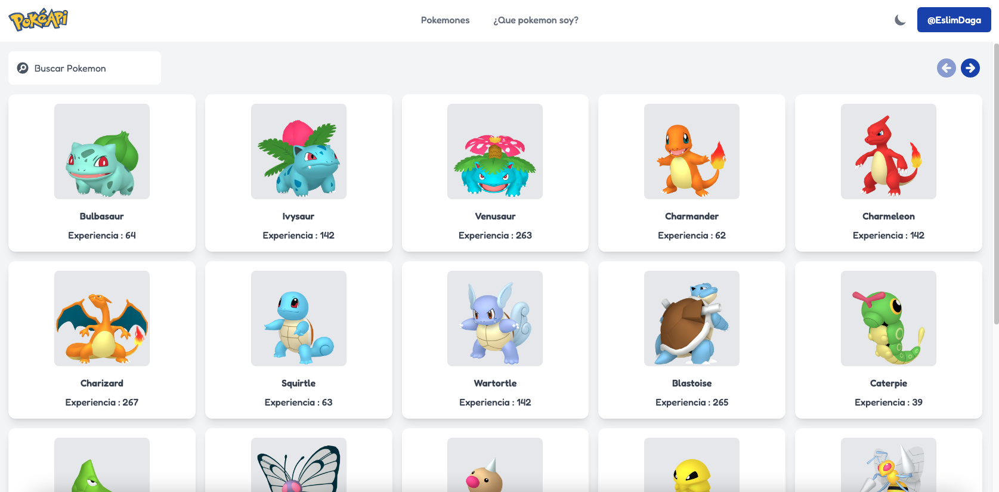

# Pokemon App 🕹

This is a my personal project "Pokemon App" using a public API.

## Installation and Setup Instructions 💻

Clone down this repository. You will need `node` and `npm` installed globally on your machine.

Installation:

`npm install`

To Start Server:

`npm start`

To Visit App:

`localhost:3000`

## Table of contents 📄

- [Pokemon App](#frontend-mentor---github-user-search-app-solution)
  - [Installation](#installation-and-setup-instructions)
  - [Table of contents](#table-of-contents)
  - [Overview](#overview)
    - [Screenshot](#screenshot)
    - [Links](#links)
  - [My process](#my-process)
    - [Built with](#built-with)
  - [Author](#author)

## Overview 🧩
### Screenshot

### Links 🔗

- Solution URL: [https://github.com/EslimDaga/react-pokemon-app](https://github.com/EslimDaga/react-pokemon-app)
- Live Site URL: [https://react-pokeapp.netlify.app/](https://react-pokeapp.netlify.app/)

## My process 📄

### Built with

- [React](https://reactjs.org/) - JS library
- [Tailwind ](https://tailwindcss.com/) - CSS framework
- [Poke API ](https://pokeapi.co/) - Poke API

## Author 👨🏻‍💻

- Frontend Mentor - [@eslimdaga](https://www.frontendmentor.io/profile/eslimdaga)
- Twitter - [@eslimdaga](https://www.twitter.com/eslimdaga)